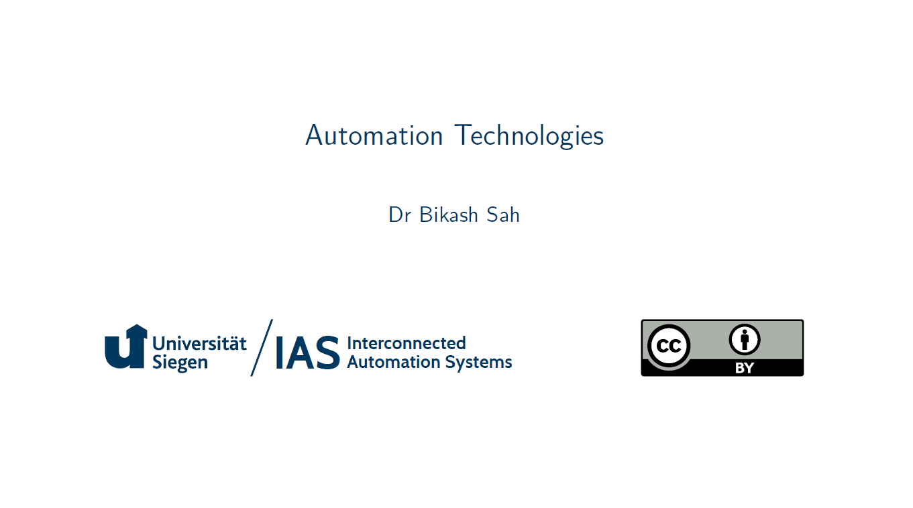
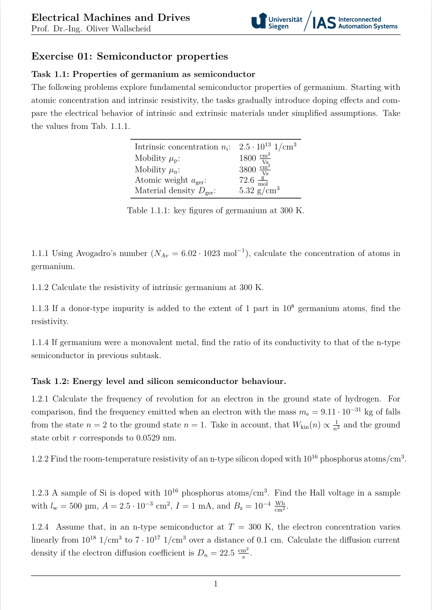
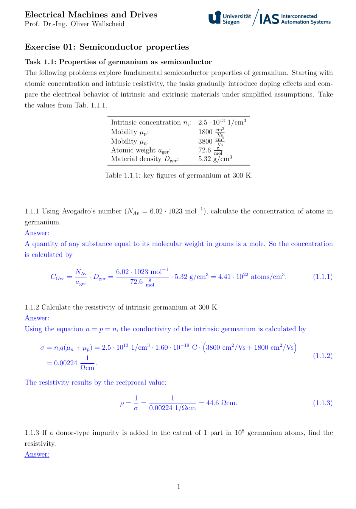

# Automation Technologies

[](https://github.com/IAS-Uni-Siegen/Automation_T/actions/workflows/BuildPDFs.yml)
[![CC BY 4.0][cc-by-shield]][cc-by]
[](https://www.python.org/)
[](https://www.latex-project.org/)
<!-- [](https://doi.org/10.5281/zenodo.14215441) -->


This work is licensed under a
[Creative Commons Attribution-ShareAlike 4.0 International License][cc-by].

[![CC BY 4.0][cc-by-image]][cc-by]

[cc-by]: http://creativecommons.org/licenses/by/4.0/
[cc-by-image]: https://licensebuttons.net/l/by/4.0/88x31.png
[cc-by-shield]: https://img.shields.io/badge/License-CC%20BY%204.0-lightgrey.svg

## Lecture slides (click on preview picture)
<a href="https://ias-uni-siegen.github.io/Automation_T/lecture.pdf" target="_blank" class="image fit"></a>

The covered topics are:
- Module I: Introduction to Automation Technologies.
- Module II: Sensor Technologies.
- Module III: Signal Conditioning.
- Module IV: Processors in Automation Systems.
- Module V: Controllers and Communication.
- Module VI: Industrial communication systems.
- Module VI: Actuators and Motion Systems.
- Module VII: Testing and Validation.
- Module VIII: Industrial Case Studies.


<!-- Should be added by TATSAT
## Exercise tasks (click on preview picture)
<a href="https://ias-uni-siegen.github.io/Automation_T/exercise.pdf" target="_blank" class="image fit"></a>

## Exercise tasks including solutions (click on preview picture)
<a href="https://ias-uni-siegen.github.io/Automation_T/exercise_with_solution.pdf" target="_blank" class="image fit"></a>

-->

<!--## Exam history

| Exam       | Only Tasks                                  | Tasks with Solutions                            |
|------------|---------------------------------------------|-------------------------------------------------|
| Summer 2025       | [Only Tasks](https://ias-uni-siegen.github.io/EMD_course/summer2024.pdf)   | [Tasks with Solutions](https://ias-uni-siegen.github.io/EMD_course/summer2024_with_solution.pdf) |
| Summer 2025 (mock-up)| [Only Tasks](https://ias-uni-siegen.github.io/EMD_course/summer2024_mock-up.pdf)   | [Tasks with Solutions](https://ias-uni-siegen.github.io/EMD_course/summer2024_mock-up_with_solution.pdf) |
-->


## Citation
See "Cite this repository" info box on the top-right or use the following BibTeX entry for citing it:
```
@misc{Sah_PEDC_2025,
    author = {Sah, Bikash},
    title = {{Power Electronics Devices (and Components)}},
    url = {https://github.com/IAS-Uni-Siegen/Automation_T},
    year = {2025}
}
```